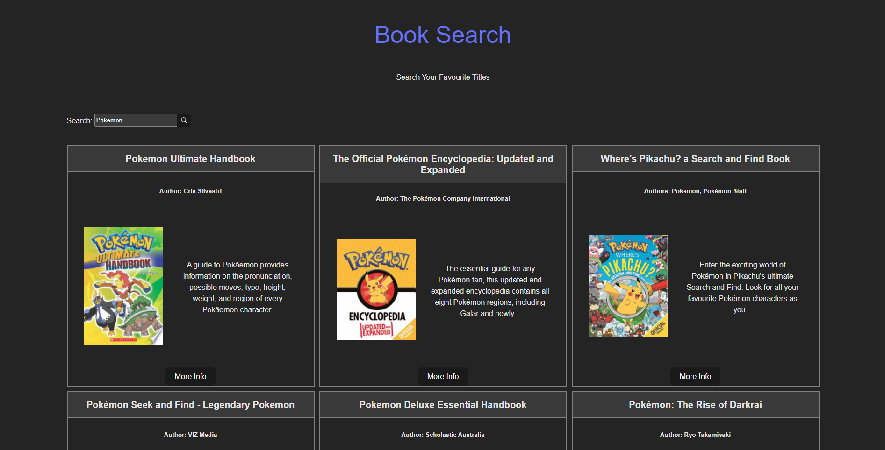

# Google-Books-List

## Preview

### Desktop
#### Home Page



#### More Info Modal


## Deployed Version

* [Link]( https://e-commerce-mock-app.vercel.app/)

## Setup

* To install dependencies open terminal cd into the root folder
 ```
 npm install
 ```
 * Run Application
 ```
 npm run dev
 ```

## Description of project (spec / MVP)

### Outline
This project will require you to use both DOM manipulation and Asynchronous programming. The aim is for the user to be able to search for a book inside the Google Books database and to be able to get more details about a certain title.

### MVP:
Create a page that allows users to search for books Page should include the following:
  - Header section introducing the page -- [x]
  - Form containing a text input and a submit / search button -- [x]
  - A grid of books Instructions:
  - When the submit button is clicked you need the request books from the Google books API using the input value as your query string -- [x]
  - The books that you receive should be rendered in the books grid. -- [x]
  - Each book in the grid should have an image, author, title and description -- [x]
  - The grid should be responsive on different screen sizes  -- [x]
  - You should use async / await for your request code, NOT .then -- [x]

Styling (required):
 - This application should look good, take some time to pick a palette and plan out your design. You can use tools like Figma or wireframe pro to plan what your application is going to look like. Styling must use BEM, and each block should have its own SCSS file Your palette should use variables

Application Design (required):
 - You should separate DOM functions and non-DOM functions in different modules. -- [x]
 - Write as many non-DOM functions as you can Functions should do 1 thing, and should be as pure and reusable as possible -- [x]
 - Always use iterators over loops -- [x]
 - Always parametrize and abstract large pieces of duplicate code. -- [x]

### Bonus (optional, but highly recommended):
* Give feedback to the user when no book results can be found for the query. -- [x]
* When a user clicks a book in the grid, a modal should appear with more book information, think about release, publish date, country, languages, etc. -- [x]
  


## Approach
* Decided to use React with Typescript for the project instead of vanilla Javascript to challenge myself and learn about type safety.
* Looked at similar web applications like IMDb online to see functionality and how error were handled.
* Played with the API hitting the endpoint to see what the structure of the json object being displayed.
* Understanding the database first was important as then I could map through the data and display it on the page.
* Typescript was completely new so research and going through the typescript docs was important in the learning process of building this application.
* React was used instead of plain JS as I wanted to create this application with more modern practices like using a javascript framework.
* SCSS was used for styling to create modular styling for each component.


## Reflection
* What went well?
  - I think the use of asynchronous programming went well as there were not many issues when fetching the data from the API.
* What are you proud of? 
  - I am proud that I decided to use typescript in this application to learn more about type safety, and the importance of it.
* What was a challenge?
  - A challenge that I can remember is when I was trying to type errors in try catch blocks. I spent a while researching the topic and found that in the catch the type would be unknown and in the body of the catch you would need to check if the error is instanceof Error. Example :
 ```
 catch (err: unknown) {
      if (err instanceof Error) {
        setError(err.message);
      }
    }
 ```
  
* What you'd do differently?
  - I would draw out a basic design using figma or even paint, because I think the styling of the application is quite plain.

## Future Goals

* Add a load more button to load more results on the page.
* Add testing.
* Style the page better, with a color palette.


## Further reading or links to inspiration

*  [Google Books API no Auth link]( https://developers.google.com/books/docs/v1/using#WorkingVolumes)
*  [Using Async Await]( https://dmitripavlutin.com/javascript-fetch-async-await/)
*  [Using Postman to Test APIs]( https://www.blazemeter.com/blog/how-use-postman-test-apis)

## Stay in touch

*  [Portfolio]( https://edric-khoo.vercel.app/)
*  [Linkedin]( https://www.linkedin.com/in/edric-khoo-98881b173/)


